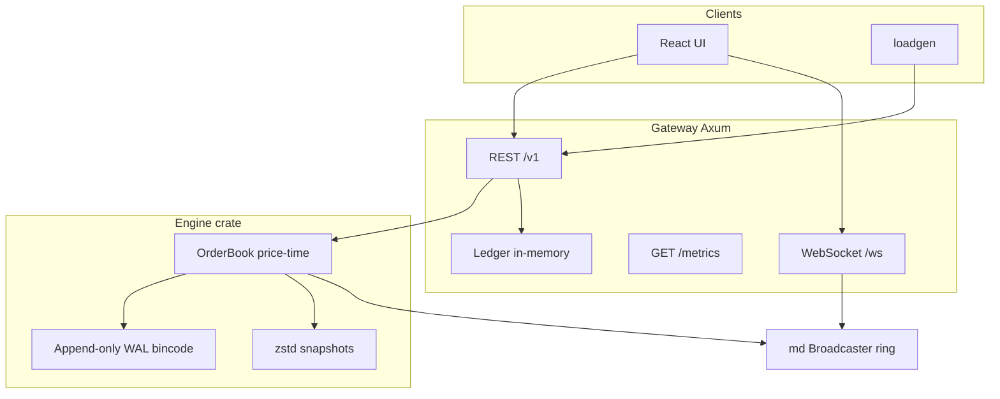

# Architecture

## Data flow

1. **Orders**: HTTP `POST /v1/orders` validates risk + ledger intent, appends `WalRecord::Place`, runs `OrderBook::place`, applies fills to the **ledger**, emits **delta** (+ optional `trade` frames) on the broadcaster, returns JSON fills.
2. **Recovery**: On startup, `Engine::restore_from_latest` loads the latest zstd snapshot (if any), then **replays the full WAL**. Order timestamps are derived from order id so replay is **deterministic** and `state_hash` matches a continuous run (see `engine/tests/integration.rs`).
3. **Market data**: A 20ms task publishes full L2 **snapshots**; each trade/cancel/replace/settle also publishes a **delta** (full top-of-book refresh) and **trade** events for the UI tape. The ring buffer stores `(seq, json)` for `snapshot_from_seq` resync.
4. **Settlement**: `POST /v1/admin/markets/:id/settle` (requires `X-Admin-Token`) writes `WalRecord::Settle`, clears simulated positions in the ledger for that market, and bumps book `seq`.

## WAL / snapshot caveat (single-node)

Snapshots are written independently of WAL truncation. Taking a snapshot does **not** truncate the WAL; replaying snapshot + full WAL can **double-apply** if both are present. For production-style behavior you would record a WAL offset in the snapshot header and replay only records after that offset (or rotate/truncate WAL on snapshot). The integration test uses **WAL-only** recovery without a snapshot file to assert determinism.
