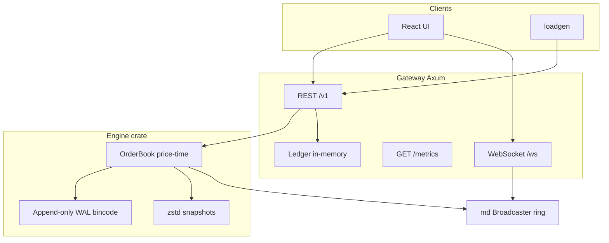

# Architecture

## Data flow

1. **Orders**: HTTP `POST /v1/orders` validates risk + ledger intent, appends `WalRecord::Place`, runs `OrderBook::place`, applies fills to the **ledger**, emits **delta** (+ optional `trade` frames) on the broadcaster, returns JSON fills. See [OrderFlow.md](OrderFlow.md) for a sequence diagram.
2. **Recovery**: On startup, `Engine::restore_from_latest` loads the latest **v2** zstd snapshot (if present), which stores the **WAL byte offset** at snapshot time. The engine then **replays only WAL records after that offset**, so snapshot + tail WAL apply exactly once. Legacy snapshot files (pre-v2, no `CHS2` header) are ignored; recovery falls back to **full WAL replay** from byte 0 (delete obsolete `snapshot-latest.bin.zst` if you relied on the old fast path). Order timestamps are derived from order id so replay is **deterministic** and `state_hash` matches a continuous run (see `engine/tests/integration.rs`).
3. **Market data**: A 20ms task publishes full L2 **snapshots**; each trade/cancel/replace/settle also publishes a **delta** (full top-of-book refresh) and **trade** events for the UI tape. The ring buffer stores `(seq, json)` for `snapshot_from_seq` resync.
4. **Settlement**: `POST /v1/admin/markets/{market_id}/settle` (requires `X-Admin-Token`) writes `WalRecord::Settle`, clears simulated positions in the ledger for that market, and bumps book `seq`.

## Snapshots and WAL (single-node)

v2 snapshots (`CHS2` magic + `wal_end_offset` + compressed book map) align with the WAL file: bytes `[0, wal_end_offset)` are reflected in the snapshot, and recovery replays `[wal_end_offset, EOF)`. Calling `snapshot_all()` flushes the WAL and records the current file length as `wal_end_offset`. The integration test `snapshot_then_tail_wal_replay_matches_single_run` covers snapshot + tail replay.

Taking a snapshot does **not** truncate the WAL; long-running nodes may still want periodic WAL rotation in a future iteration.
