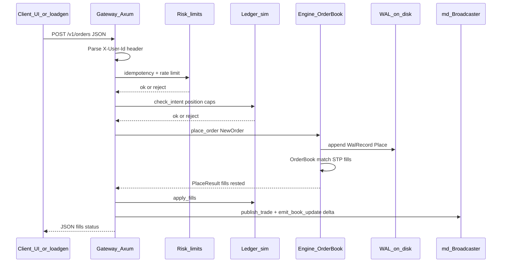

# Order placement flow (HTTP to book)

This diagram shows how a single `POST /v1/orders` request moves through the gateway into the engine and out to market-data subscribers.

**Notes**

- The engine persists **before** applying the match (`WAL` append then `place`) so recovery can replay the same sequence.
- WebSocket clients receive **delta** and **trade** frames from `md`, not the HTTP response body.
- Settlement and cancel/replace follow the same pattern: WAL record first, then book mutation, then MD update.
